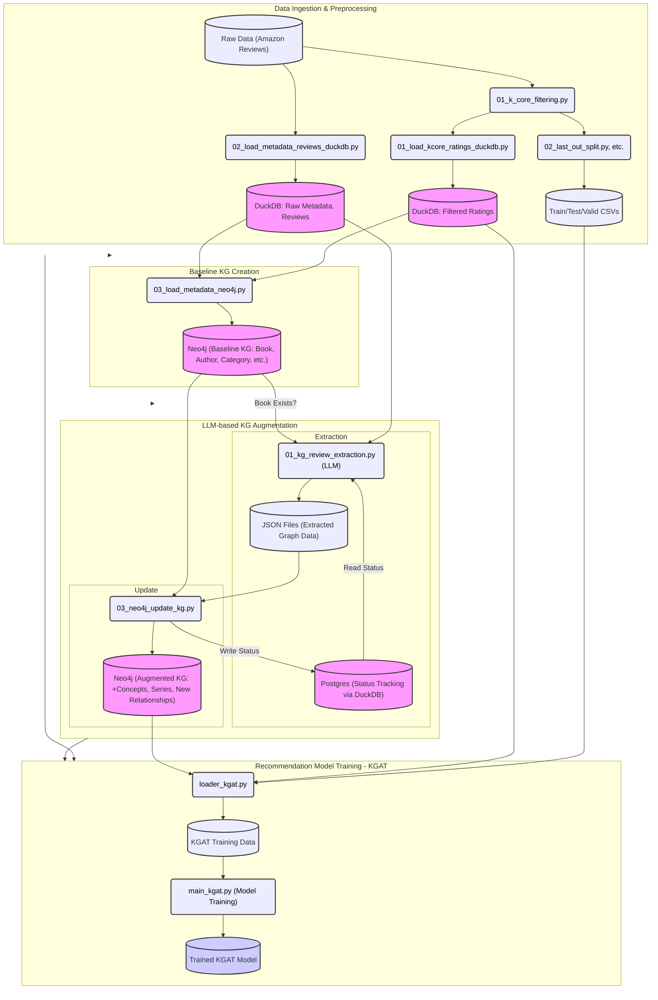

## Data Sources and Initial Processing

This section outlines the initial phase of our recommendation system pipeline, focusing on the data sources and the preliminary processing steps applied to prepare the data for subsequent stages.

### Primary Data Source

The primary dataset used for this project is the **Amazon Reviews dataset**, specifically focusing on the **Books category**. This dataset provides a rich source of user reviews and ratings, which are essential for training and evaluating our recommendation models.

### K-core Filtering

**Purpose:** To ensure a certain level of data quality and to mitigate data sparsity issues, we apply K-core filtering. This process retains only users and items that have a minimum number of interactions. For instance, we might set K=15, meaning only users who have reviewed at least 15 books and books that have received at least 15 reviews are kept. This helps in building more robust and reliable models.

**Script:** The K-core filtering is performed by the following script:
```bash
src/preprocess/rec/01_k_core_filtering.py
```

### Data Splitting

**Purpose:** After K-core filtering, the data is split into training, validation, and test sets. This is a crucial step for model evaluation and hyperparameter tuning.
- The **training set** is used to train the recommendation models.
- The **validation set** is used to tune hyperparameters and make decisions about model architecture.
- The **test set** is used for the final evaluation of the trained model's performance on unseen data.

**Scripts:** The data splitting process is handled by scripts such as:
```bash
src/preprocess/rec/02_last_out_split.py
# (and potentially other scripts depending on the splitting strategy, e.g., random split, temporal split)
```

### Loading Ratings to DuckDB

**Purpose:** Processed ratings, especially positive interactions (e.g., ratings above a certain threshold), are loaded into a DuckDB database for efficient querying and access during subsequent knowledge graph construction and model training phases.

**Process:** The filtered and processed ratings are stored in DuckDB tables. Key tables include:
- `rating_only`: Stores all processed ratings.
- `rating_only_positive`: Stores only positive ratings, which are often the primary focus for recommendation tasks.

**Script:** The loading of these ratings into DuckDB is managed by the script:
```bash
src/kg-preprocess/01_load_kcore_ratings_duckdb.py
```

## Baseline Knowledge Graph (KG) Creation

This section details the process of constructing the baseline Knowledge Graph (KG) using metadata associated with the items (books) from our processed dataset.

### Script Responsible

The primary script for creating and loading the baseline KG into Neo4j is:
```bash
src/kg-preprocess/03_load_metadata_neo4j.py
```

### Metadata Source

The metadata for the books is sourced from the **Amazon Reviews metadata** (Books category), which is conveniently available via the **Hugging Face Hub**. This metadata includes details such as title, authors, publisher, categories, and related items.

### Filtering Logic

A crucial step before loading data into Neo4j is filtering the metadata. We only include items (books) that are present in the `rating_only_positive` table in DuckDB. This ensures that the KG is built around items for which we have positive user interaction data, making it relevant for recommendation tasks.

### Neo4j Loading

The filtered metadata is then used to populate a Neo4j graph database. This involves creating nodes and relationships:

**Node Types Created:**
-   **`Book`**: Represents individual books.
    -   Key properties: `asin` (Amazon Standard Identification Number, used as a unique ID), `title`, `description`, `price`, `imUrl` (image URL), `brand` (often the publisher or author imprint), `parent_asin` (used for different editions or formats of the same book).
-   **`Author`**: Represents the authors of the books.
    -   Key properties: `name` (author's name).
-   **`Publisher`**: Represents the publishers of the books.
    -   Key properties: `name` (publisher's name).
-   **`Category`**: Represents the genres or categories books belong to.
    -   Key properties: `name` (category name).

**Relationship Types Created:**
-   **`WRITTEN_BY`**: Connects `Book` nodes to `Author` nodes.
-   **`PUBLISHED_BY`**: Connects `Book` nodes to `Publisher` nodes (if publisher information is available and reliable).
-   **`CATEGORIZED_UNDER`**: Connects `Book` nodes to `Category` nodes.

**Constraints and Indexes:**
To ensure data integrity and optimize query performance, constraints and indexes are created in Neo4j. For example:
-   Unique constraints are typically set on node properties like `Book.asin` and `Author.name`.
-   Indexes are created on properties frequently used in lookups, such as `Book.title`, `Category.name`, etc.
This helps in faster data retrieval and prevents duplicate entries.

## LLM-based KG Augmentation

This phase focuses on enriching the baseline Knowledge Graph by extracting new entities and relationships from user reviews using Large Language Models (LLMs).

### Review Selection

To efficiently process a vast number of reviews, a selection process is implemented.

**Script:**
```bash
src/kg-extract/01_kg_review_extraction.py
```

**Criteria:** Reviews are selected based on a combination of factors to prioritize informative content:
-   **Helpful Votes:** Reviews with a higher number of "helpful" votes are prioritized.
-   **Review Length:** Longer reviews are often more detailed and likely to contain extractable information.
-   **Book Existence in Neo4j:** The review must be for a book already present in our Neo4j KG.
-   **Processing Status:** Reviews that have not already been processed are selected.

### LLM Extraction

Selected reviews are then processed by an LLM to extract structured graph information.

**Tools:**
-   **LLM Backend:** The system is configurable to use different LLMs, such as GPT models (via `ChatOpenAI`) or open-source models like Llama (via `ChatOllama`).
-   **Graph Extraction:** LangChain's `LLMGraphTransformer` is utilized to convert unstructured text (reviews) into graph data (nodes and relationships).

**Process:**
The LLM is prompted with the review text and details of the book being reviewed. The prompt is designed to guide the LLM to identify and extract:
-   **New Node Types:** Such as `Concept` (e.g., "machine learning", "space opera") and `Series` (e.g., "Harry Potter", "Dune series").
-   **New Relationship Types:**
    -   `SIMILAR_TO_BOOK`: Linking the reviewed book to other books mentioned as similar.
    -   `DEALS_WITH_CONCEPTS`: Linking books to concepts discussed within them.
    -   `PART_OF_SERIES`: Linking books to the series they belong to.

### Intermediate Storage

The graph data extracted by the LLM is temporarily stored as JSON files before being integrated into the main Neo4j KG. Each file represents the extracted graph from a single review.

**Path Pattern:** Extracted data is typically organized by the LLM model used and the type of relationship. Individual files are named to ensure uniqueness and traceability: `output/{model_name}/{relationship_type}/{timestamp}_{user_id}_{item_id}.json` (e.g., `output/gpt-3.5-turbo/SIMILAR_TO_BOOK/20231026103000_AUSER123_B000FA5KKA.json`).

### Updating Neo4j KG

The extracted graph information is then used to update the central Neo4j Knowledge Graph.

**Script:**
```bash
src/kg-extract/03_neo4j_update_kg.py
```

**Process:**
1.  **Read JSON Data:** The script reads the LLM-extracted graph data from the intermediate JSON files.
2.  **Cache Neo4j Data:** To optimize performance and avoid redundant queries, existing relevant data from Neo4j (e.g., book titles, concept names, series names) is cached.
3.  **Node Matching/Creation:**
    -   For `Concept` and `Series` nodes, fuzzy matching (e.g., using libraries like `thefuzz`) is employed to identify if a similar node already exists.
    -   If a close match is found, an alias might be added to the existing node, or the relationship might be linked to the existing node.
    -   If no sufficiently similar node exists, a new node is created.
4.  **Relationship Creation:**
    -   `SIMILAR_TO_BOOK`: Relationships are created between the reviewed book and other books. Fuzzy matching is used on book titles to find the corresponding `Book` nodes in Neo4j.
    -   `DEALS_WITH_CONCEPTS`: Relationships are created between `Book` nodes and `Concept` nodes.
    -   `PART_OF_SERIES`: Relationships are created between `Book` nodes and `Series` nodes.

### Status Tracking

To manage the multi-stage processing of reviews and ensure idempotency, a status tracking mechanism is employed.

**Mechanism:** A Postgres table named `review_processing_status` (often queried via DuckDB for convenience within the Python environment) is used. This table tracks the state of each review through different stages:
-   `processed`: Indicates that the LLM has processed the review and the output has been saved to a JSON file.
-   `KG_updated`: Indicates that the information extracted from this review has been successfully integrated into the Neo4j Knowledge Graph.

This tracking prevents reprocessing of reviews and allows for resuming the pipeline from the last successful step in case of interruptions.

## Recommendation Model Training (Focus on KGAT)

This section describes the training phase of our recommendation system, with a specific focus on the Knowledge Graph Attention Network (KGAT) model. KGAT leverages the structured information in our Neo4j Knowledge Graph to enhance recommendation quality.

### Data Preparation (`DataLoaderKGAT`)

Effective training of KGAT requires data to be formatted in a specific way, combining user-item interactions with the knowledge graph structure.

**Script:**
```bash
src/dataloader/loader_kgat.py
```

**Inputs:**
-   **User-Item Interactions:** Sourced from the processed and split datasets (train/validation/test sets obtained from the "Data Splitting" phase). These typically include user IDs, item IDs, and interaction labels (e.g., positive feedback).
-   **KG Structure from Neo4j:** The script queries the Neo4j database to fetch the graph structure, including entities (books, authors, categories, concepts, series) and their relationships.

**Outputs:** The `DataLoaderKGAT` class prepares and provides the following for the KGAT model:
-   **Mappings:** Dictionaries mapping original entity and relation IDs/names to contiguous integer indices suitable for model input.
-   **KG Adjacency Representation (`A_in`):** A representation of the KG's adjacency matrix (or similar structure like a list of tuples for sparse graphs) that captures how entities are connected. This is crucial for the attention mechanism to propagate information through the graph.
-   Batched training data containing user-item pairs and their corresponding KG context.

### KGAT Model Overview

The Knowledge Graph Attention Network (KGAT) is a graph neural network model designed to exploit KG relations for better recommendations.

**Core Idea:** KGAT enriches item and user representations by recursively propagating embeddings from their neighbors in the KG. This allows the model to learn complex patterns and reasons behind user preferences based on item attributes and connections.

**Attention Mechanism:** A key component of KGAT is its attention mechanism. When aggregating information from an entity's neighbors, the model learns to assign different importance (attention weights) to different neighbors. For example, for a given book, certain related entities (e.g., a specific author or concept) might be more influential in determining a user's preference than others.

**Script:** The implementation of the KGAT model can be found in:
```bash
src/models/KGAT.py
```

### Training Process (`src/main_kgat.py`)

The main script orchestrates the training and evaluation of the KGAT model.

**Script:**
```bash
src/main_kgat.py
```

**Key Steps:**
1.  **Initialization:** The KGAT model is initialized with the KG structure provided by `DataLoaderKGAT`, including the number of entities, relations, and the adjacency representation (`A_in`). Embeddings for users, items, and other KG entities are also initialized.
2.  **Combined Loss Function:** The model is trained by optimizing a combined loss function that typically includes:
    -   **Collaborative Filtering (CF) Loss:** This component focuses on the user-item interaction data. It aims to predict user preferences for items based on historical interactions (e.g., using Bayesian Personalized Ranking (BPR) loss or a similar pairwise loss).
    -   **Knowledge Graph (KG) Loss:** This component aims to preserve the structure of the knowledge graph. It often involves treating triplets (head entity, relation, tail entity) from the KG as positive examples and optimizing the model to score these triplets highly (e.g., using a margin-based loss like TransR or a similar KG embedding loss).
3.  **Attention Mechanism Updates:** During training, the parameters of the attention mechanism are learned. This allows the model to dynamically adjust the importance of different KG paths and neighbors when generating user and item embeddings.
4.  **Evaluation:** The model's performance is evaluated on the validation and test sets using standard recommendation metrics:
    -   **Precision@K:** The proportion of recommended items in the top-K set that are relevant.
    -   **Recall@K:** The proportion of relevant items that are successfully recommended in the top-K set.
    -   **NDCG@K (Normalized Discounted Cumulative Gain):** A measure of ranking quality that considers the position of relevant items.

## Overall System Architecture Diagram

The following diagram illustrates the entire LAKR (LLM-Augmented Knowledge Graph for Recommendation) pipeline, from raw data ingestion to recommendation model training.


